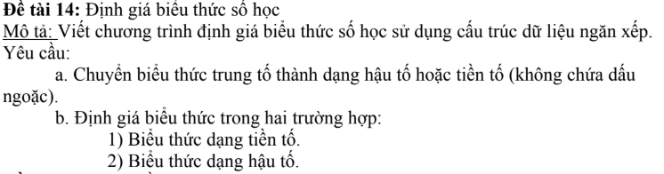
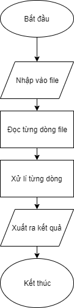

****

#### Problem: Write a program evaluate the math expression using Stack as data structure.
##### Convert infix expressions to prefix and postfix exps (without parentheses) and evaluate them. 

****
## Programming Language
This program is coded that correspond with C programming language.
****
## IDE
Visual Studio 2019

****
## Contributer:
1. Nguyen Van Dai - Danang university of Tech
2. Nguyen Thi Thuy Trinh - Danang university of Tech
   
**** 
## Program structures
#### Main Program
